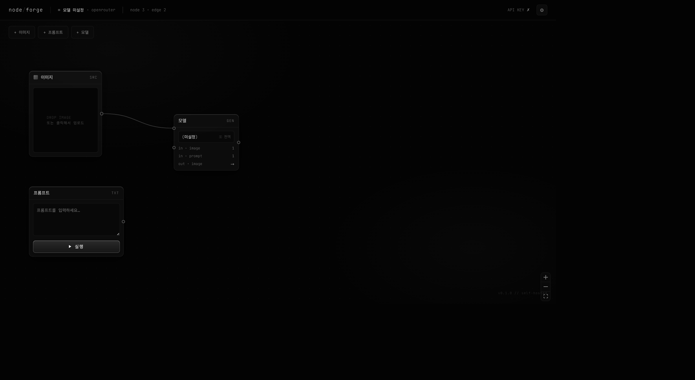

# node/forge

노드 그래프 기반 AI 이미지 생성 도구. 프롬프트·이미지·모델을 노드로 연결해 직관적으로 이미지를 생성하고, 결과를 다시 그래프에 재투입해 연쇄 편집할 수 있다.



## 핵심 개념

- **노드 3종**: 이미지(SRC) · 프롬프트(TXT) · 모델(GEN) — 생성 결과는 일반 이미지 노드와 동일하게 취급되어 다시 입력으로 연결 가능 (연쇄 편집)
- **실행 단위**: 전체 그래프가 아니라 **프롬프트 노드 단위**로 짧은 브랜치만 실행 (n8n 방식)
- **실패 정책**: 생성 실패 시 자동 재시도 최대 3회 → 소진 시 알림
- **설정**: 전역 모델 1개 + OpenRouter API 키 (모두 로컬 저장)
- **셀프호스팅**: 이미지·키 전부 로컬 파일시스템

## 실행

```bash
npm install
npm run build
npm start          # http://localhost:7837
```

개발 모드:

```bash
npm run dev        # Vite dev server (:5173, /api 프록시)
```

## 사용 흐름

1. ⚙ 설정에서 OpenRouter API 키 입력 + 모델 선택 (전역 1개)
2. 이미지 노드에 드래그앤드롭으로 소스 업로드 (선택)
3. 프롬프트 노드에 텍스트 작성
4. `이미지 → 모델 ← 프롬프트` 로 연결
5. 프롬프트 노드의 **실행** 버튼 → 결과 노드가 모델 출력에 연결된 상태로 추가됨
6. 같은 조합으로 재실행하면 결과가 계속 쌓이고, 결과 이미지를 다시 모델에 연결해 이어서 편집

## 스택

- 프론트엔드: React 18 + [@xyflow/react](https://reactflow.dev) (React Flow)
- 백엔드: Express (Node.js)
- API: [OpenRouter Image API](https://openrouter.ai/docs) (`POST /api/v1/images`, 이미지 참조 `input_references`)

## 라이선스

MIT
